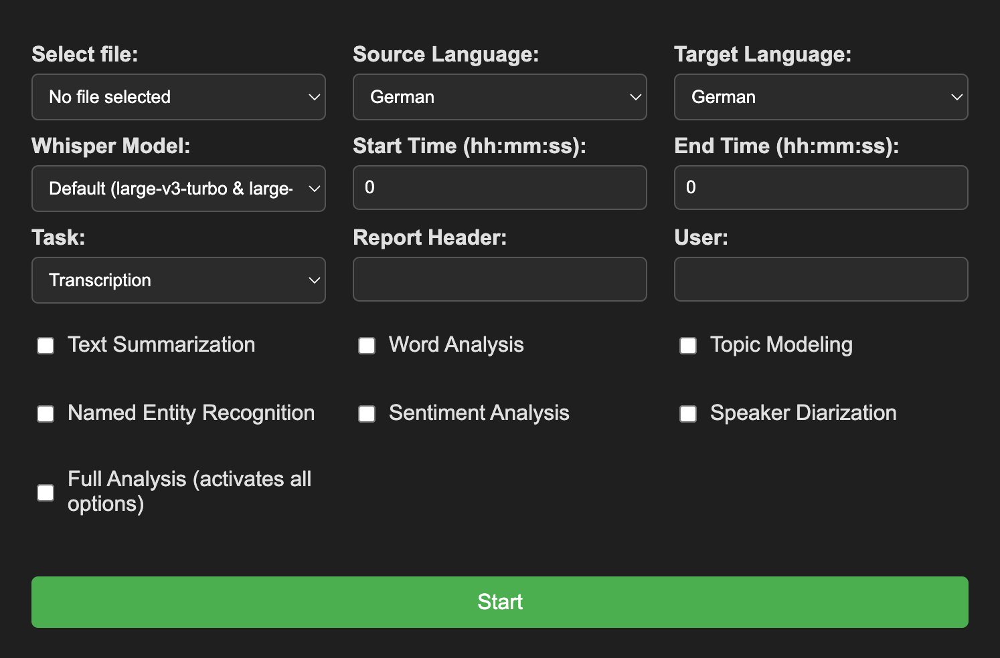

# VeryEssence


**VeryEssence** leverages ML models to transcribe, translate and analyse natural language from audio/video. It is modular by 
design to provide the best flexibility for data analysis and can be used as a Flask app and through the command line. 
Results are shown in a structured PDF report.

> This is a personal project that is under heavy development. It could, and likely does, contain bugs, incomplete code,
> or other unintended issues. As such, the software is provided as-is, without warranty of any kind.
> 
> If you intend to deploy this project in a production environment with multi-user access (e.g. as a web app), it is
> recommended to replace the existing credential handling with a more secure approach.


## Installation
### Prerequisites
- 30 GB free space 
- 24 GB VRAM
- [`uv`](https://github.com/astral-sh/uv) for Python version and dependency management
- [Hugging Face](https://huggingface.co/) account and an access token


### Classic Setup
#### 1. Repository, Environment Variables, and Dependencies
Clone the repository:
```bash
git clone https://github.com/nos-tromo/VeryEssence.git
cd VeryEssence
```

Set GPU-related environment variables before creating the virtual environment:
##### Linux
```bash
export CMAKE_ARGS="-DGGML_CUDA=on"
export FORCE_CMAKE=1
```
##### macOS
```zsh
export CMAKE_ARGS="-DGGML_METAL=on"
export FORCE_CMAKE=1
```
##### Windows
```powershell
$Env:CMAKE_ARGS = "-DGGML_CUDA=on"
$Env:FORCE_CMAKE = "1"
```
Create the virtual environment and install the dependencies:
```bash
uv sync
```

#### 2. Download Tokenizers and Stopwords
Download the `nltk` files:
```bash
uv run python -c "import nltk; nltk.download('punkt'); nltk.download('punkt_tab'); nltk.download('stopwords')"
```

#### 3. Download Hugging Face Models
To download all models directly to your local machine you need a [Hugging Face](https://huggingface.co/)  account and set an access token:
##### Linux / macOS
```bash
echo "Enter your Hugging Face token: " 
read -s HF_HUB_TOKEN
echo "HF_HUB_TOKEN=$HF_HUB_TOKEN" >> .env
```
##### Windows
```powershell
$HF_HUB_TOKEN = Read-Host -Prompt "Enter your Hugging Face token" -AsSecureString
$BSTR = [System.Runtime.InteropServices.Marshal]::SecureStringToBSTR($HF_HUB_TOKEN)
$UnsecureToken = [System.Runtime.InteropServices.Marshal]::PtrToStringAuto($BSTR)
"HF_HUB_TOKEN=$UnsecureToken" | Out-File -FilePath ".env" -Encoding UTF8
```
Log into Hugging Face Hub:
```bash
uv run huggingface-cli login --token $HF_HUB_TOKEN
```

The default directory where Hugging Face models are stored is `~/.cache/huggingface/hub`. Subdirectories are named 
something like `models--openai--whisper-large-v3-turbo`. Download the models on another machine and paste them if your 
main platform has no internet connection. Some developers require you to accept their TOS before granting access to 
their models (see the respective model card).

[Gemma 2](https://blog.google/technology/developers/google-gemma-2/) is a multilingual LLM with advanced language understanding and reasoning capabilities which makes it a 
good fit for text summarization. The following quant sizes are suggestions depending on your machine's hardware. Comment 
out the model files that are not required:

##### Linux / macOS
```bash
directory=gguf
mkdir -p $directory/ && 
curl -L -o $directory/gemma-2-9b-it-Q8_0.gguf \
https://huggingface.co/bartowski/gemma-2-9b-it-GGUF/resolve/main/gemma-2-9b-it-Q8_0.gguf && \
curl -L -o $directory/gemma-2-9b-it-Q4_K_M.gguf \
https://huggingface.co/bartowski/gemma-2-9b-it-GGUF/resolve/main/gemma-2-9b-it-Q4_K_M.gguf && \
curl -L -o $directory/gemma-2-2b-it-Q8_0.gguf \
https://huggingface.co/bartowski/gemma-2-2b-it-GGUF/resolve/main/gemma-2-2b-it-Q8_0.gguf
```
##### Windows
```powershell
$directory = "gguf"
New-Item -Path $directory -ItemType Directory -Force
Invoke-WebRequest -Uri "https://huggingface.co/bartowski/gemma-2-9b-it-GGUF/resolve/main/gemma-2-9b-it-Q8_0.gguf" -OutFile "$directory/gemma-2-9b-it-Q8_0.gguf"
Invoke-WebRequest -Uri "https://huggingface.co/bartowski/gemma-2-9b-it-GGUF/resolve/main/gemma-2-9b-it-Q4_K_M.gguf" -OutFile "$directory/gemma-2-9b-it-Q4_K_M.gguf"
Invoke-WebRequest -Uri "https://huggingface.co/bartowski/gemma-2-2b-it-GGUF/resolve/main/gemma-2-2b-it-Q8_0.gguf" -OutFile "$directory/gemma-2-2b-it-Q8_0.gguf"
```

`transformers` models will be downloaded upon first usage, but you can also download them beforehand (skip unnecessary 
models):

```bash
# transcription models
uv run huggingface-cli download openai/whisper-large-v3-turbo
uv run huggingface-cli download openai/whisper-large-v3
uv run huggingface-cli download openai/whisper-large-v2
uv run huggingface-cli download openai/whisper-medium
uv run huggingface-cli download openai/whisper-small
uv run huggingface-cli download openai/whisper-base
uv run huggingface-cli download openai/whisper-tiny
# topic modeling
uv run huggingface-cli download sentence-transformers/all-MiniLM-L6-v2
uv run huggingface-cli download sentence-transformers/paraphrase-multilingual-mpnet-base-v2
# speaker diarization
uv run huggingface-cli download pyannote/speaker-diarization-3.1
```

#### 4. Additional Requirements
VeryEssence requires [`ffmpeg`](https://ffmpeg.org/) to be installed on your machine:
```bash
# Ubuntu/Debian
sudo apt update && sudo apt install ffmpeg
# macOS
brew install ffmpeg
# Windows
choco install ffmpeg
```

#### 5. Offline Mode (Optional)
In case VeryEssence is intended to run in a firewalled or offline environment, set this variable after finishing the model 
downloads: 

##### Linux / macOS
```bash
echo 'export HF_HUB_OFFLINE=1' >> .venv/bin/activate
```
##### Windows
> Add the following line manually to .venv/Scripts/Activate.ps1 placed above the signature block (Line "# SIG # Begin 
> signature block").
```powershell
$env:HF_HUB_OFFLINE = "1"
```

### Docker Setup
> !!!!! Under construction... !!!!!

The Docker container is built for Linux machines with CUDA-compatible GPU. For other systems, refer to the above 
installation method. Make sure [Docker](https://www.docker.com/) and the [NVIDIA Container Toolkit](https://docs.nvidia.com/datacenter/cloud-native/container-toolkit/latest/install-guide.html) 
are installed. Your Hugging Face token needs to be passed to the container via Docker BuildKit:

```bash
export DOCKER_BUILDKIT=1
echo "Enter your Hugging Face token: " 
read token
echo "$token" > .hf_token.txt
if ! grep -qxF ".hf_token.txt" .gitignore; then
    echo ".hf_token.txt" >> .gitignore
fi
chmod 600 .hf_token.txt
```

Build the Docker image:

```bash
docker build --secret id=hf_token,src=.hf_token.txt -t veryessence_docker .
rm .hf_tocken.txt
```

## Usage
### Option 1: Graphical User Interface
VeryEssence comes with a `Flask` integration. If you are on Linux or macOS, simply run `./run.sh` (add `--debug` for 
debugging mode) to activate the virtual environment and start the Flask server in the background. Otherwise, use 
something like `python app.py`, `python -m flask run`, or `flask run`. You might have to make the script executable with 
`chmod +x ./run.sh`. Then, open `http://127.0.0.1:5000` in your browser to access the app:



If you installed VeryEssence with Docker, run the container to start the Flask server:

```bash
docker run --gpus all -p 5000:5000 veryessence_docker
```
```bash
./docker_run.sh
```

### Option 2: Command Line
Running `cli.py` from the command line supports the following arguments:

```
-h, --help - Show this help message and exit.
-f, --file - Specify the file path and name of the audio file to be transcribed.
-s, --start - Set the starting timecode for transcription in hh:mm:ss format (default: 0).
-e, --end - Set the ending timecode for transcription in hh:mm:ss format (default: 0).
-sl, --src-lang - Specify the language code (ISO 639-1) of the source audio (default: 'de').
-tl, --tgt-lang - Specify the language code (ISO 639-1) of the target language (default: 'de').
-m, --model - Choose the model checkpoint for processing (sizes: tiny, base, small, medium, large-v2, large-v3, default; default: default).
-t, --task - Select from 0 (language detection), 1 (transcription), 2 (translation), or 3 (transcription & translation) (default: 1).
-w, --words - Show most frequently used words (default: False).
-ta, --topics - Enable topic modeling analysis (default: False).
-ner, --entities - Enable named entity recognition (default: False.
-sent, --sentiment - Enable sentiment analysis (default: False).
-d, --diarization - Enable speaker diarization (default: False).
-sum, --summarization - Additional text and topic summarization (default: False).
-hdr, --header - Add a header to the report.
-u, --user - Add a username to the report.
-o, --output - Specify the output directory (default: output).
-F, --full-analysis - Enable full analysis, equivalent to using -w -ta -ner -tox -d -sum (default: False).
```

You can let VeryEssence iterate over multiple files in a directory:

#### Linux / macOS
```bash
for file in path/to/your/directory/*; do
    python cli.py [PARAMETERS]
done
```

#### Windows
```powershell
$files = Get-ChildItem -Path 'path\to\your\directory' -File

foreach ($file in $files) {
    $filePath = $file.FullName
    python cli.py -f $filePath [PARAMETERS]
}
```

### Examples
Processing single files:
```bash
uv run python cli.py -f audio.mp3 -s 00:00:30 -e 00:05:00 -sl en -m large -t 1 -a
```
```bash
uv run python cli.py -f lecture.wav --start 00:10:00 --end 00:45:00 --src-lang es --tgt-lang it --model base --task 3
```
```bash
uv run python cli.py -f recording.wav -F
```
```bash
uv run python cli.py -f uploads/example_en.mp4 -sl en -F -hdr EXAMPLE -u exampleuser
```

Iterating over a directory:

#### Bash
```bash
for file in uploads/*; do
    uv run python cli.py "$file" -sl fr -d -t 3
done
```

#### PowerShell
```powershell
$files = Get-ChildItem -Path 'user/machine/uploads' -File

foreach ($file in $files) {
    $filePath = $file.FullName
    uv run python cli.py -f $filePath
}
```

### Autogenerated Report
Running a VeryEssence task returns a variety of output files, including [transcriptions](examples/example_en_transcribe_en.txt), and an autogenerated 
[PDF report](examples/REPORT_1731787527_example_en.pdf) that sums up the most relevant findings:

1. Text Summarization: A brief overview of the content of the text, highlighting the main points.
2. Keywords: Important words and phrases extracted from the text that represent the main topics or themes.
3. Word Cloud/Histogram: A visual and statistical representation of the most common words in the text, where the size of 
each word indicates its frequency.
4. Topic Modeling: An analysis that identifies different topics present in the text and shows how frequently each topic 
appears. This includes charts and maps to visualize the relationships between topics.
5. Named Entity Recognition (NER): A process that identifies and categorizes key entities mentioned in the text, such as 
people, locations, organizations, and more.
6. Sentiment Analysis: This identifies and counts any negative language present in the text. It highlights 
sentences that may contain offensive or aggressive language.
7. Speaker Diarization: An analysis that identifies and counts the number of speakers in the text, which is useful in 
dialogues or multi-speaker settings.

### Logfiles
If you face errors or unusual behavior, see `.logs` for further debugging.

## Feedback
I hope you find VeryEssence to be a valuable tool for analysis. If you have any feedback or suggestions on how to improve 
VeryEssence, please let me know. I'm always looking for ways to improve this tool to better serve the community.
